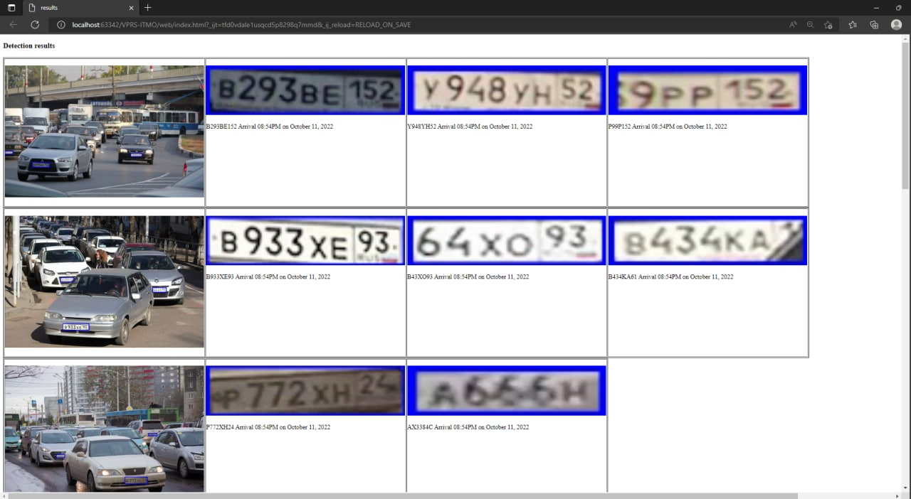

# VPRS-ITMO
Vehicle Plate Recognition System project

Prepare:
```bash
conda create -n vprs python=3.7
conda avtivate vprs
pip3 install -r requirements.txt 
```
Run:
```bash
python demo.py
```

Resulting log webpage is in web/ folder

