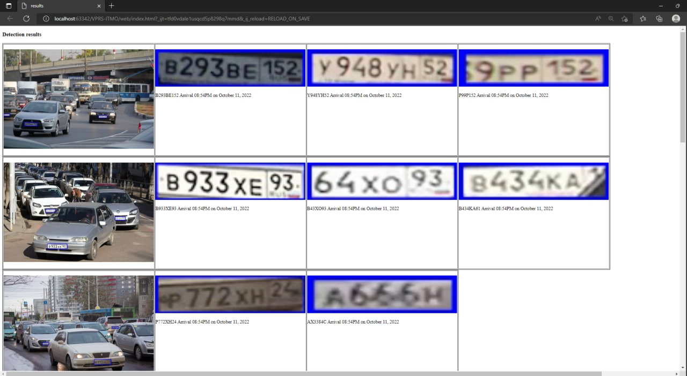
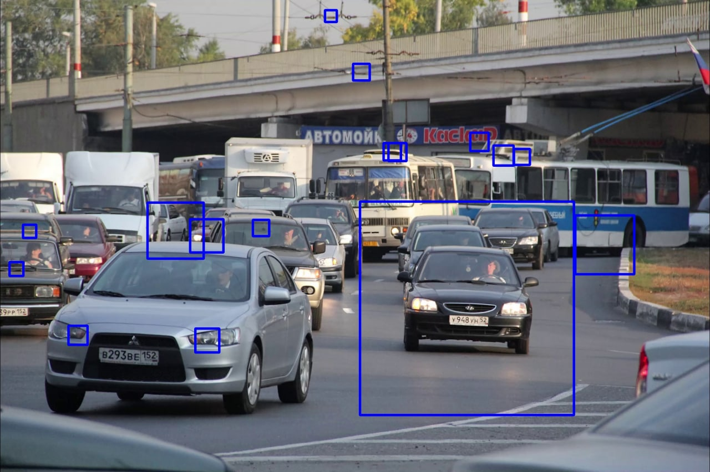
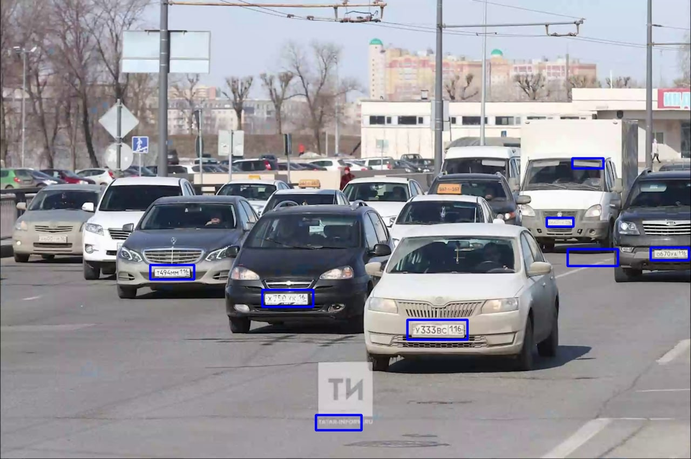
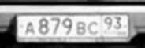
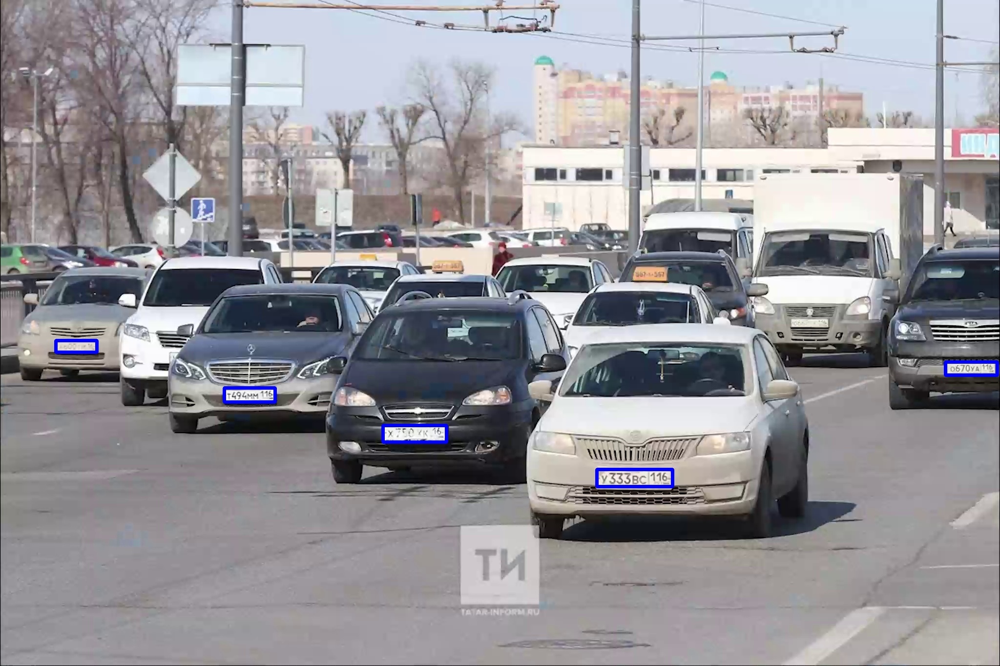
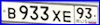

# VPRS-ITMO
Vehicle Plate Recognition System project

Prepare:
```bash
conda create -n vprs python=3.6
conda activate vprs
pip3 install -r requirements.txt 
```
Run:
```bash
python demo.py
```

Resulting log webpage is in web/ folder



# Metrics


* IoU - metric, which changes in the range from 0 to 1, shows how much
  the so-called coverage area coincides with two objects (reference (ground true) and current).
  Ideal value 1. Used to determine the correct detection of cars and license plates


* AP is the average over multiple IoU (the minimum IoU to consider a positive match). 
  AP@[.5:.95] corresponds to the average AP for IoU from 0.5 to 0.95 with a step size of 0.05. 
  mAP (mean average precision) is the average of AP.
  
# Prediction speed

- The processing time of one image, on which there are up to 5 cars,
on which license plates are visible, is approximately 5 seconds per CPU

- For real-time work, it is recommended to use the GPU
  
# Сhoosing the best model


1.  Detector we used YOLOv5

| Model       | mAP@[.5]                |
| ------------- |:------------------:|
| yolov5m     | 0.867    |
| yolov5s     | 0.712 | 
| yolov5x  | 0.891         |

2.  Text recognition we used CRAFT

Experiments were made with the model settings,
namely the learning rate, the type of optimizer (AdamW and Adam)
and the scheduler. This made it possible to increase the recognition quality by 3.5%.

3. Training params:
  * Batch size: 16
  * Image size: 640x640
  * Epochs: 4

# Experiments we've done:


- OpenCV cascade classifier to detect car bboxes: 

- OpenCV cascade classifier to detect number plate bboxes:

- Pytesseract to recognize number plate symbols:
<br>
<br>A867BG93<br>
- YoloV5 to detect number plate bboxes:

- Nomeroff-net OCR to recognize plate number symbols:
<br> <br>B933XE93

# Experiments setup:


Hardware 
- CPU count: 1 Ryzen 4600H

All experiments were performed on a Ryzen 4600H CPU. For a faster recognition process,
it is recommended to use the GPU